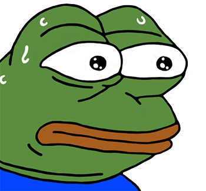

# 안녕하세요, 이하늘 입니다!

> 계속 다니고 싶은 회사 처럼  
> _"**같이 일하고 싶은 잠재력있는** 프론트엔드 개발자"_  
> (⬆️ 목표입니다!) 🧑‍💻🧑‍💻🧑‍💻

## - Contact.

- Email : <neu1hi.work@gmail.com>
- Phone : 010-0000-0000

## - Channel.

- GitHub : https://github.com/neulhi

---

5일차 Markdown 문법을 검색해 가며 작성 중입니다.

 
 

...  

 
 
 
 
 
 
 
 

 
 
 
 
 
 
 
 

<!-- 

 -->

파이팅!!!!!!!!!!!!!!!!!!!!

- [README](https://github.com/neulhi/homework/blob/main/README.md "README.md")
